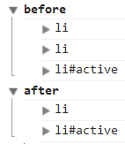

### DOM
## HTMLCollection
- 리턴결과가 복수인 경우 사용하는 객체
- 복수의 경우에 HTMLCollection 에 담아서 리턴됨
- 유사배열로 배열과 비슷한 사용방법을 가지고 있지만 배열은 아니다
- HTMLCollection의 목록은 실시간으로 변경됨
- [HTMLCollection 스펙](https://www.w3.org/TR/2003/REC-DOM-Level-2-HTML-20030109/html.html#ID-75708506)

```
<ul>
  <li>HTML</li>
  <li>CSS</li>
  <li id="active">JavaScript</li>
</ul>

<script>
  console.group('before');
  var lis = document.getElementsByTagName('li');
  for(var i = 0; i < lis.length; i++){
    console.log(lis[i]);
  }
  console.groupEnd();

  console.group('after');
  lis[1].parentNode.removeChild(lis[1]);
  for(var i = 0; i < lis.length; i++){
    console.log(lis[i]);
  }
  console.groupEnd();
</script>
```
- 결과



> HTMLCollection은 '실시간'으로 변경되기 때문에 다시 재조회할 필요없다.<br/>조회 : var lis = document.getElementsByTagName('li'); 로 lis에 HTMLCollection객체를 담는 것<br/>재조회 : lis[1].parentNode.removeChild(lis[1]);를 통해 lis[1]가 삭제되고 이 삭제된 상태를 적용하기 위하여<br/>다시 var lis = document.getElementsByTagName('li');를 사용해 lis에 HTMLCollection객체를 담는 것<br/>즉, 제거 된 순간에 바로 반영되기 때문에 따로 변수에 담아 리스트를 재조회하지 않아도 된다.

- `console.group() : 인자이름으로 console 결과를 그룹해줌`
- `console.groupEnd() : 그룹종료`
