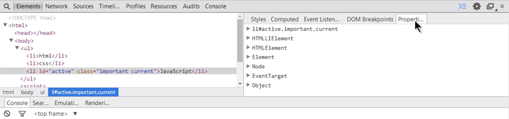

### DOM
## Element 객체
- 엘리먼트를 추상화한 객체
```
<ul>
  <li id='active'>Javascript</li>
</ul>

<script>
  var t = docment.getElementById('active')
</script>
```
> t가 가르키는 객체는 HTMLLIElement 이다.<br/>모든 HTML 엘리먼트들의 부모는 HTMLElement이므로 t 또한 HTMLElement의 자식이 된다.<br/>그리고 HTMLElement는 Element를 부모로 가진다.

- HTMLElement는 모든 Element에 대한 공통적인 기능을 제공한다.<br/>HTMLElement이 가진 대표적인 특성은 style 프로퍼티가 있다.<br/>또한, HTMLElement의 부모는 ELement이다.

- 왜 굳이 HTMLElement와 ELement를 나눌까?<br/>DOM이 꼭 HTML 만을 제어하기 위한 언어는 아니기 때문이다.<br/>HTML이나 XML, SVG, XUL과 같이 마크업 형태의 언어를 제어하기위한 표준이기때문에 그 각각의 언어들은 각각의 Element를 갖는다.<br/>그리고 각각의 구체적인 언어(HTML,XML,SVG)를 위한 기능은 HTMLElement, SVGElement, XULElement와 같은 객체를 통해서 추가해서 사용하고 있다.<br/>즉, style 프로퍼티 같은 경우에 Element 객체에는 없고 HTMLElement의 객체만의 프로퍼티로 존재한다.<br/>이를통해 알수 있는점은 다른 언어가 DOM을 지원하고 있다면 수월하게 익힐 수 있다는 것이다.

- `마크업 : 열리고 닫히는 형태의 언어 ex) <html></html>`


#### 개발자 도구에서 특정태그에 대한 Property를 확인할 수 있음


> 상속적인 관계도 시각적으로 확인 가능

## 다른 객체들과의 관계


> DOM의 계층구조에서의 Element 객체의 위치


## 주요기능
- 식별자 : 문서내에서 특정한 엘리먼트를 식별하기 위한 용도로 사용되는 API
```
Element.classList
Element.className
Element.id
Element.tagName
```

- 조회 : 엘리먼트의 하위 엘리먼트를 조회하는 API
```
Element.getElementsByClassName
Element.getElementsByTagName
Element.querySelector
Element.querySelectorAll
```

- 속성 : 엘리먼트의 속성을 알아내고 변경하는 API
```
Element.getAttribute(name)
Element.setAttribute(name, value)
Element.hasAttribute(name);
Element.removeAttribute(name);
```
