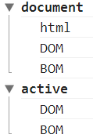

### DOM
## 조회 API
- 엘리먼트를 조회하는 기능
  - document.getElementsBy* : document(문서전체) 엘리먼트를 조회
  - element.getElementsBy* : 해당 엘리먼트의 하위 엘리먼트를 대상으로 조회
```
<ul>
  <li class="marked">html</li>
  <li>css</li>
  <li id="active">JavaScript
    <ul>
      <li>JavaScript Core</li>
      <li class="marked">DOM</li>
      <li class="marked">BOM</li>
    </ul>
  </li>
</ul>

<script>
  var list = document.getElementsByClassName('marked');
  
  console.group('document');
  for(var i=0; i<list.length; i++){
    console.log(list[i].textContent);
  }
  console.groupEnd();

  console.group('active');
  var active = document.getElementById('active');     
  var list = active.getElementsByClassName('marked');
  for(var i=0; i<list.length; i++){
    console.log(list[i].textContent);
  }
  console.groupEnd();
</script>
```
- 결과



> 문서내에서 marked를 class로 가진 모든 엘리먼트 조회<br/>id가 active인 엘리먼트의 하위 class가 marked인 엘리먼트 조회

- `textContent : 태그에 속한 text를 리턴`
