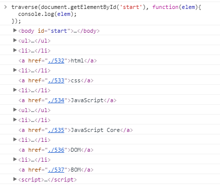
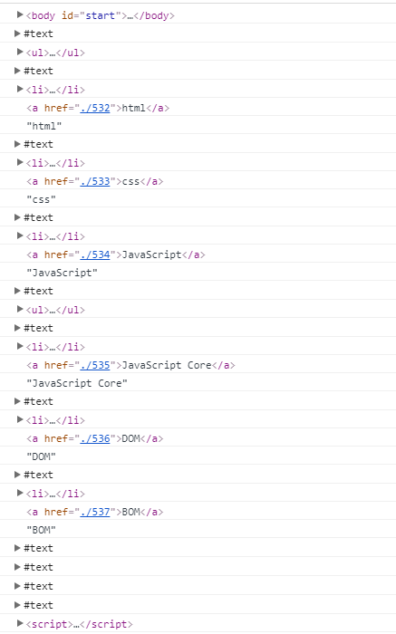

### DOM
## 노드 종류 API
- 현재 선택된 노드가 어떤 타입인지를 판단해야 하는 경우
- Node.nodeType : node의 타입을 의미 
- Node.nodeName : node의 이름 (태그명을 의미)


## Node Type
- 노드의 종류에 따라서 정해진 상수가 존재
  - 상수 : 정해져있는 값
```
for(var name in Node){
  console.log(name, Node[name]);
}
```
- 결과
```
ELEMENT_NODE 1 
ATTRIBUTE_NODE 2 
TEXT_NODE 3 
CDATA_SECTION_NODE 4 
ENTITY_REFERENCE_NODE 5 
ENTITY_NODE 6 
PROCESSING_INSTRUCTION_NODE 7 
COMMENT_NODE 8 
DOCUMENT_NODE 9 
DOCUMENT_TYPE_NODE 10 
DOCUMENT_FRAGMENT_NODE 11 
NOTATION_NODE 12 
DOCUMENT_POSITION_DISCONNECTED 1 
DOCUMENT_POSITION_PRECEDING 2 
DOCUMENT_POSITION_FOLLOWING 4 
DOCUMENT_POSITION_CONTAINS 8 
DOCUMENT_POSITION_CONTAINED_BY 16 
DOCUMENT_POSITION_IMPLEMENTATION_SPECIFIC 32
```
> 모든 노드의 종류와 종류에 따른 값을 출력 (상수)

```
<body id="start">
<ul>
  <li><a href="./532">html</a></li> 
  <li><a href="./533">css</a></li>
  <li><a href="./534">JavaScript</a>
    <ul>
      <li><a href="./535">JavaScript Core</a></li>
      <li><a href="./536">DOM</a></li>
      <li><a href="./537">BOM</a></li>
    </ul>
  </li>
</ul>

<script>
  var body = document.getElementById('start');
  body.firstChild.nodeType === 3  // true
  body.firstChild.nodeType === Node.TEXT_NODE  // true
  body.firstChild.nodeName  // #text
</script>
</body>
```
> body.firstChild.nodeType = 공백(줄바꿈) = 3 = Node.TEXT_NODE = #text

> 해당 숫자(상수)를 통해 엘리먼트의 타입을 알 수 있음<br/>비교할때 숫자를 통해 비교하면 기억하기 힘드므로 콘솔창에서 `Node.`작성 후 자동채우기(드롭박스)로 접근


## 재귀함수
- 어떤 함수가 실행될 때, 자기 자신을 호출하는 것
```
function traverse(target, callback){
  if(target.nodeType === 1){
    callback(target);
    var c = target.childNodes;
    for(var i=0; i<c.length; i++){
      traverse(c[i], callback);       
    }   
  }
}
traverse(document.getElementById('start'), function(elem){
  console.log(elem);
});
```
- 결과



> body와 body의 자식 엘리먼트 하나하나를 전부 출력함


#### 이 로직의 사용법
```
traverse(document.getElementById('start'), function(elem){
  elem.style.color = 'red';
});
```
> 모든 태그를 빨간색으로 바꿈
```
traverse(document.getElementById('start'), function(elem){
  if (elem.nodeName === "A") {
    elem.style.color = 'blue';
  }
});
```
> 모든 A태그들을 빨간색으로 바꿈


#### 로직 분해 해석
```
traverse(document.getElementById('start'), function(elem){
  console.log(elem);
});
```
> 여기에서 elem은 현재 조회하고있는 엘리먼트를 담는다.


```
function traverse(target, callback){
  callback(target);
}
```
> 여기에서 target은 탐색하려고하는 루트 엘리먼트이고,<br/>여기에서 callback은 자기자신을 실행시키기 위한 함수로, 각각의 엘리먼트들을 조회할때마다 해당되는 엘리먼트를 사용자가 작성한 함수의 인자(elem)로 전달할 함수이다.<br/>현재, callback은 function(elem){console.log(elem)}; 와 같다.

> `callback : 내부적으로 호출되는 방식으로 나중에 호출될것을 의미`

- 결과
```
body#start
```
> callback 매개변수가 실행되면 function(elem){console.log(elem)};이 실행되고,<br/>이때 elem은 target이 되고, 이 target은 document.getElementById('start')가 된다.

> 인자로 전달한 즉, 탐색하려고하는 첫번째 엘리먼트를 두번째 인자인 함수의 인자로 전달해 그것을 내부적으로 사용할 수 있도록 했다.

```
function traverse(target, callback){
  callback(target);
  var c = target.childNodes;
}
```
> body의 하위엘리먼트들을 열거하기위한 준비
```
function traverse(target, callback){
  callback(target);
  var c = target.childNodes;

  for(var i=0; i<c.length; i++){
    traverse(c[i], callback);       
  } 
}
```
> 자식 노드들에 대한 유사배열을 반복문을 통해 열거한다.

> body의 하위엘리먼트들을 호출하도록 코드(재귀함수 이용)했다.<br/>자식엘리먼트 하나하나를 traverse의 첫번째 인자로 전달하고 각각의 엘리먼트들의 자식엘리먼트들을 다시 traverse의 인자로 전달한다.

> 즉, for문이 회전할때마다 하위노드들을 가져오고, 가져온 하위노드들을 다시 traverse함수 첫번째 인자로 전달하게되면 더이상 자식이 없을때까지 즉, for문이 동작하지않을때까지 자식노드들을 찾아서 넣어줌

- 결과



> 모든 노드들이 출력됨

```
function traverse(target, callback){
  if(target.nodeType === Node.ELEMENT_NODE){  // == 1
    callback(target);
    var c = target.childNodes;
    for(var i=0; i<c.length; i++){
      traverse(c[i], callback);       
    }   
  }
}
```
> 엘리먼트노드가 아닌것들을 배제시켜서 출력

```
function traverse(target, callback){
  if(target.nodeType === Node.ELEMENT_NODE){
    if(target.nodeName === 'A'){
      callback(target);
      var c = target.childNodes;
      for(var i=0; i<c.length; i++){
        traverse(c[i], callback);       
      }
    }   
  }
}
```
> a 태그 노드만을 출력


#### 알게된 점
- 원하는 노드들을 필터링
- ChildNode를 통한 자식노드 조회
- traverse를 통한 재귀함수 개념을 파악
- 함수를 다른함수의 인자로 전달하는것을 통해 함수가 값으로 사용될수있다는 사실
- 콜백함수


### TIP
- 로직이 어떻게 사용될것인지를 먼저 구상한 뒤 로직을 작성하는 것이 좋다.
