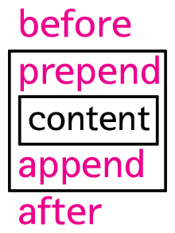

### DOM
## jQuery 노드 변경 API
- jQuery에서 노드를 제어하는 기능은 주로 [Manipulation](http://api.jquery.com/category/manipulation/) 카테고리에 속함

## 추가
- before : 해당 태그 위에 위치 (위 형제)
- after : 해당 태그 아래에 위치 (아래 형제)
- prepend : 해당 태그 안쪽 내용 위에 위치 (content 위, 위 자식)
- append : 해당 태그 안쪽 내용 아래에 위치 (content 아래, 아래 자식)



> 주요한 메소드 4가지의 관계도

```
<div class="target">content1</div>
<div class="target">content2</div>
 
<script src="//code.jquery.com/jquery-1.11.0.min.js"></script>
<script>
  $('.target').before('<div>before</div>');
  $('.target').after('<div>after</div>');
  $('.target').prepend('<div>prepend</div>');
  $('.target').append('<div>append</div>');
</script>
```
- [결과](http://output.jsbin.com/gamezi/1/)
```
<div>before</div>
<div class="target">
  <div>prepend</div>
  content1
  <div>append</div>
</div>
<div>after</div>

<div>before</div>
<div class="target">
  <div>prepend</div>
  content2
  <div>append</div>
</div>
<div>after</div>
```
> 제어하고자하는 대상이 복수일 때, 그 객체들에게 모두 적용됨


## 제거
- remove : 선택된 엘리먼트를 제거
- empty : 선택된 엘리먼트의 텍스트노드를 제거
```
<div class="target" id="target1">target 1</div>  // (1)
<div class="target" id="target2">target 2</div>  // (2)
 
<input type="button" value="remove target 1" id="btn1" />
<input type="button" value="empty target 2" id="btn2" />

<script src="//code.jquery.com/jquery-1.11.0.min.js"></script>
<script>
  $('#btn1').click(function(){
    $('#target1').remove();
  })
  $('#btn2').click(function(){
    $('#target2').empty();
  })
</script>
```
- [결과](http://output.jsbin.com/bocay/1/)
```
(1) 통째로 제거
(2) <div class="target" id="target2"></div> 글자만 제거
```


## 교체
- replaceAll : 제어대상을 뒤 인자로 전달함 (제어대상이 뒤, 교체대상을 앞에 지정)
- replaceWith : 제어대상을 먼저 지정함 (제어대상이 앞, 교체대상을 뒤에 지정)
```
<div class="target" id="target1">target 1</div>
<div class="target" id="target2">target 2</div>
 
<input type="button" value="replaceAll target 1" id="btn1" />
<input type="button" value="replaceWith target 2" id="btn2" />

<script src="//code.jquery.com/jquery-1.11.0.min.js"></script>
<script>
  $('#btn1').click(function(){
    $('<div>replaceAll</div>').replaceAll('#target1');
  })

  $('#btn2').click(function(){
    $('#target2').replaceWith('<div>replaceWith</div>');
  })
</script>
```
- [결과](http://output.jsbin.com/kotuv/1/)
```
<div class="target" id="target1">replaceAll</div>
<div class="target" id="target2">replaceWith</div>
```
> 실행 결과는 동일하나 방법이 다르다.


## 복제
- clone
```
<div class="target" id="target1">target 1</div>  // (1)
<div class="target" id="target2">target 2</div>  // (2)
<div id="source">source</div>

<input type="button" value="clone replaceAll target 1" id="btn1" />
<input type="button" value="clone replaceWith target 2" id="btn2" />

<script src="//code.jquery.com/jquery-1.11.0.min.js"></script>
<script>
  $('#btn1').click(function(){
    $('#source').clone().replaceAll('#target1');
  })

  $('#btn2').click(function(){
    $('#target2').replaceWith($('#source').clone());
  })
</script>
```
- [결과](http://output.jsbin.com/bisuz/1/)
```
<div id="source">source</div>
<div id="source">source</div>
```
> 결과는 동일<br/>clone 함수가 붙으며, 교체와 같이 제어대상의 위치가 다르다.


## 이동
- dom manipulation : API의 인자로 특정 노드를 선택하면 이동의 효과가 남
```
<div class="target" id="target1">target 1</div>
<div id="source">source</div>
 
<input type="button" value="append source to target 1" id="btn1" />

<script src="//code.jquery.com/jquery-1.11.0.min.js"></script>
<script>
  $('#btn1').click(function(){
    $('#target1').append($('#source'));
  })
</script>
```
- [결과](http://output.jsbin.com/yujen/3/)
```
<div class="target" id="target1">
  target 1
  <div id="source">source</div>
</div>
```
> 해당 태그(#target1)의 안쪽 내용 아래로 인자(#source)를 추가시킴(이동)
