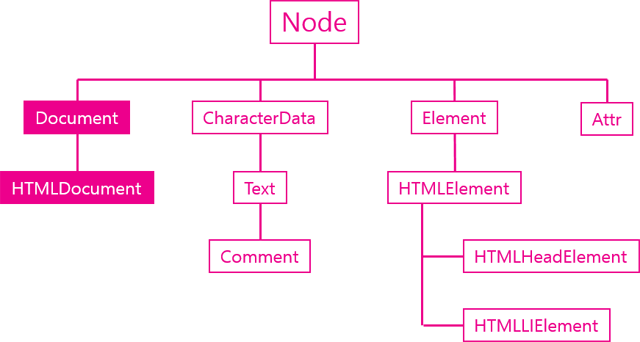

## Document 객체



- Document 객체는 DOM의 스팩이고 웹브라우저에서 HTMLDocument 객체로 사용됨
- HTMLDocument 객체는 문서전체를 대표하는 객체
```
console.log(window.document);
```
> document 객체는 window 객체의 소속이다.
```
console.log(window.document.childNodes[0]);
```
- 결과
```
<!DOCTYPE html>
```
```
console.log(window.document.childNodes[1]);
```
- 결과
```
<html>
  <head></head>
  <body></body>
</html>
```
> document 객체의 자식으로는 Doctype과 html이 있다. 즉, 문서전체다.


## 주요 API
### 노드 생성 API
- document 객체의 주요임무는 새로운 노드를 생성해주는 역할임
- createElement()
- createTextNode()
```
document.createElement
```

### 문서정보 API
- title
- URL
- referrer
- lastModified
```
document.title
```
- 결과
```
Document 객체 - 생활코딩
```
