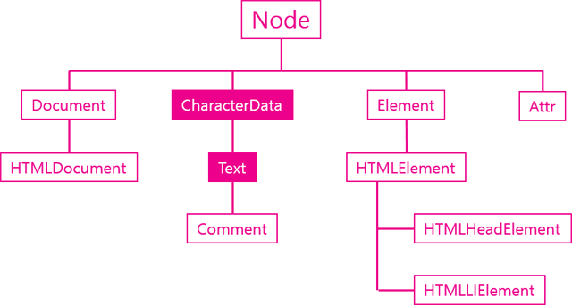

## Text 객체
- 텍스트 객체는 텍스트 노드에 대한 DOM 객체로 CharcterData를 상속 받음
- DOM에서는 공백이나 줄바꿈도 텍스트 노드
- DOM에서는 공백 또한 제어가 가능하므로 하나의 객체로 식별함




```
<p>생활코딩</p>
```
> p 태그는 Element에 속하고 '생활코딩'은 Text에 속한다.

```
<p id="target1"><span>Hello world</span></p>
<p id="target2">
  <span>Hello world</span>
</p>
```
- 텍스트 노드를 찾는 예제
```
var t1 = document.getElementById('target1').firstChild;
var t2 = document.getElementById('target2').firstChild;
 
console.log(t1.firstChild.nodeValue);

try {
  console.log(t2.firstChild.nodeValue);   
} catch(e) {
  console.log(e);
}
console.log(t2.nextSibling.firstChild.nodeValue);
```
- 결과
```
Hello world

TypeError {stack: (...), message: "Cannot read property 'nodeValue' of null"}

Hello world
```
```
var t1 = document.getElementById('target1');
var t2 = document.getElementById('target2');

console.log(t1);  // <p></p>
console.log(t1.firstChild);  // <span></span>
console.log(t1.firstChild.firstChild);  // Hello world

console.log(t2);  // <p></p>
console.log(t2.firstChild);  // text 객체(공백)
console.log(t2.firstChild.nextSibling);  // <span></span>
```


## 주요기능
### 값
- 텍스트 노드의 값을 가져오는 API
- data
- nodeValue
```
<ul>
  <li id="target">html</li> 
  <li>css</li>
  <li>JavaScript</li>
</ul>

<script>
  var t = document.getElementById('target').firstChild;

  console.log(t.nodeValue);  // html
  console.log(t.data);  // html
</script>
```

### 조작
- appendData()
```
function callAppendData(){
  target.appendData(data.value);
}
```
- deleteData()
```
function callDeleteData(){
  target.deleteData(start.value, end.value);
}
```
- insertData()
```
function callInsertData(){
  target.insertData(start.value, data.value);
}
```
- replaceData()
```
function callReplaceData(){
  target.replaceData(start.value, end.value, data.value);
}
```
- subStringData()
```
function callSubstringData(){
  alert(target.substringData(start.value, end.value));
}
```


### 생성
- [docuemnt.createTextNode()](https://opentutorials.org/module/904/6701)
