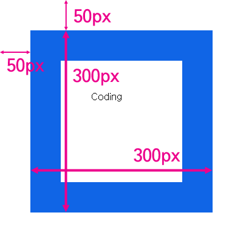
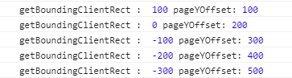
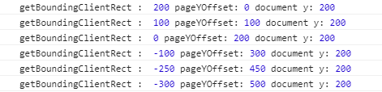
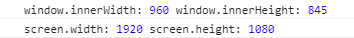

## 문서의 기하학적 특성
- 요소들의 위치와 크기를 알아내는 방법
- 문서의 엘리먼트들의 크기, 위치, 화면에 표시하기 위해서 사용하는 스크롤

## 요소의 크기와 위치
```
<style>
  body{
    padding:0;
    margin:0;
  }
  #target{
    width:100px;
    height:100px;
    border:50px solid #1065e6;
    padding:50px;
    margin:50px;
  }
</style>

<div id="target">Coding</div>
```
- 결과



> 엘리먼트의 테두리와 body 태그 사이의 거리가 50px<br/>테두리를 포함한 엘리먼트의 크기는 300px

- getBoundingClientRect : 엘리먼트의 크기와 위치를 알아냄
```
var t = document.getElementById('target');
console.log(t.getBoundingClientRect());
```
- 결과
```
clientRect {}
  bottom: 350
  height: 300
  left: 50
  right: 350
  top: 50
  width: 30
```
> Element는 margin값을 포함하지 않는다.
> 단, IE는 getBoundingClientRect의 width, height 값을 제공하지 않는다.

(결과 [실행](http://output.jsbin.com/rewad/1/))

- 엘리먼트가 중첩된 상태일 경우
```
<style>
body{
  padding:0;
  margin:0;
}
div{
  border:50px solid #1065e6;
  padding:50px;
  margin:50px;
}
#target{
  width:100px;
  height:100px;
}
</style>

<div>
  <div id="target">Coding</div>
</div>
```
- 결과


> 문서와의 거리 200px<br/>즉, 문서(body)와 특정 엘리먼트 사이에 어떤 엘리먼트가 존재해도 상관없음을 의미한다.

```
<script>
  var t = document.getElementById('target');
  console.log(t.getBoundingClientRect());
  console.log(t.offsetParent);
</script>
```
- 결과
```
clientRect {}
  bottom: 500
  height: 300
  left: 200
  right: 500
  top: 200
  width: 300
```
```
body
```
> 엘리먼트의 위치를 의미하는 top, right의 값을 통해서 기준이 그 부모가 아니라 body라는 것을 알 수 있다.<br/>이를 명시적으로 확인할 수 있는 방법은 offsetParent 속성을 호출하는 것이다.<br/>만약 부모 중 CSS position의 값이 static인 td, th, table 엘리먼트가 있다면 이 엘리먼트가 offsetParent가 된다.

> 단, 오래된 브라우저에서는 getBoundingClientRect를 지원하지 않을 수 있기 때문에 이런 경우 offsetLeft와 offsetTop 프로퍼티를 사용한다.

(결과[실행](http://output.jsbin.com/vuxit/1/))

- ClientWidth, ClientHeight : 테두리를 제외한 엘리먼트의 크기
```
var t = document.getElementById('target');
console.log('clientWidth:', t.clientWidth, 'clientHeight:', t.clientHeight);
```
- 결과
```
clientWidth: 200   clientHeight: 200
```
(결과 [실행](http://output.jsbin.com/gucef/1/))


## Viewport
- 문서의 내용 중 사용자에게 보여주는 영역


## Viewport의 좌표
- 문서의 좌표가 있고 뷰포트의 좌표가 있음
- 스크롤이 동작해서 사용자에게 보여지는 영역을 뜻함 (실제 문서의 크기)
- getBoundingClientRect : viewport 좌표 \/ viewport에서 Element까지의 거리

```
<style>
body{
  padding:0;
  margin:0;
}
div{
  border:50px solid #1065e6;
  padding:50px;
  margin:50px;
}
#target{
  width:100px;
  height:2000px;
}
</style>

<div>
  <div id="target">Coding</div>
</div>
```
```
var t = document.getElementById('target');
setInterval(function(){
  console.log('getBoundingClientRect : ', t.getBoundingClientRect().top, 'pageYOffset:', window.pageYOffset);
}, 1000)
```
- [결과](http://jsbin.com/moguvo/2/edit?html,output)



> 1초에 한번씩 getBoundingClientRect의 top 속성과 window.pageYOffset의 값이 출력된다.<br/>스크롤을 동작할때마다 콘솔창에 해당 위치의 좌표를 알려준다.

- `pageYOffset : 스크롤의 정도를 px로 리턴 (오래된 브라우저에서는 pageYOffset 대신 scrollTop 사용)`

- `setInterval : 해당 시간에 한번씩 함수를 반복실행`


## 문서의 좌표
- 문서의 좌표 : getBoundingClientRect(veiwport좌표) + pageYOffset(스크롤된 정도)
- element와 body 사이의 거리 즉, top의 크기
```
setInterval(function(){
  console.log('getBoundingClientRect : ', t.getBoundingClientRect().top, 'pageYOffset:', window.pageYOffset, 'document y:', t.getBoundingClientRect().top+window.pageYOffset);
}, 1000)
```
- [결과](http://output.jsbin.com/wefew/3/)




## 스크롤
- 스크롤을 특정 위치로 위치시킴
- scrollLeft, scrollTop, scrollTo

```
<style>
  body{
    padding:0;
    margin:0;
  }
  div{
    border:50px solid #1065e6;
    padding:50px;
    margin:50px;
  }
  #target{
    width:100px;
    height:2000px;
  }
</style>

<input type="button" id="scrollBtn" value="scroll(0, 1000)" />

<script>
  document.getElementById('scrollBtn').addEventListener('click',   function(){
    window.scrollTo(0, 1000);
   })
</script>

<div>
  <div id="target">Coding</div>
</div>
```
- [결과](http://jsbin.com/simey/1/edit?html,output)

> x로 0만큼 y로 1000만큼 스크롤 이동


## 스크린 크기
- 스크린의 크기는 모니터의 크기와 브라우저 뷰포트의 크기가 있음
- window.innerWidht, innerHeight : Viewport(윈도우 창) 크기
- screen.width, height : 스크린(모니터) 크기

```
console.log('window.innerWidth:', window.innerWidth, 'window.innerHeight:', window.innerHeight);

console.log('screen.width:', screen.width, 'screen.height:', screen.height);
</script>
```
- [결과](http://jsbin.com/buhuh/1/edit?html,output)


