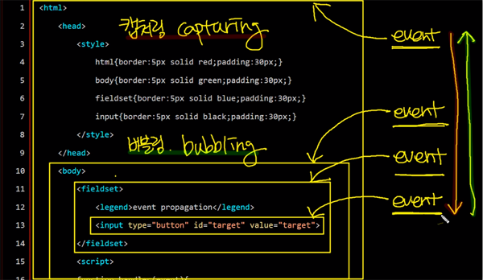
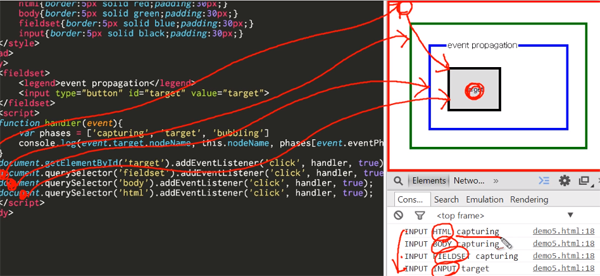

### 이벤트
## 이벤트 전파
- HTML 태그는 중첩되어 있어서 특정한 태그에서 발생하는 이벤트는 중첩되어 있는 태그들 모두가 대상이 될 수 있고 이 중첩된 태그들에 이벤트가 등록 되어 있을때의 처리방법으로 캡처링과 버블링이 있다.
- 즉, 어떤식으로 이벤트를 호출(전파)할 것인가에 대한 방식을 정하는 것

<br/>
> 태그가 전부 중첩되어있고 각각 같은 이벤트를 가지고있는 형태
```
  function handler(event){
    var phases = ['capturing', 'target', 'bubbling']
    console.log(event.target.nodeName, this.nodeName, phases[event.eventPhase-1]);
  }
```
>`event.target : 중첩된 태그들 중 가장 깊숙한 곳에 위치한 가장 구체적인 엘리먼트`<br/>this.nodeName : 이벤트 핸들러가 호출된 해당 엘리먼트<br/>phases[event.eventPhase-1] : 해당 handler의 모드 정보

- `event.eventPhases : handler가 실행될때 어느 방식(모드)으로 실행됐는지의 정보`
> eventPhases 값<br/>Event.CAPTURING_PHASE(캡쳐링) = 1<br/>Event.AT_TARGET(타겟) = 2 (=event.target)<br/>Event.BUBBLING_PHASE(버블링) = 3
- [event 인터페이스 eventPhases 상수정리](https://developer.mozilla.org/en-US/docs/Web/API/Event/eventPhase)

## 캡처링(capturing)
- 부모에서 자식 순으로 event가 작동 (위에서 아래로)
- addEventListener의 3번째 인자가 true
```
document.getElementById('target').addEventListener('click', handler, true);
```
- 결과
```
INPUT INPUT target
```

```
document.querySelector('fieldset').addEventListener('click', handler, true);
```
- 결과
```
INPUT FIELDSET capturing
```

```
document.querySelector('body').addEventListener('click', handler, true);
```
- 결과
```
INPUT BODY capturing
```

```
document.querySelector('html').addEventListener('click', handler, true);
```
- 결과
```
INPUT HTML capturing
```
```
document.getElementById('target').addEventListener('click', handler, true);
document.querySelector('fieldset').addEventListener('click', handler, true);
document.querySelector('body').addEventListener('click', handler, true);
document.querySelector('html').addEventListener('click', handler, true);
```
- 결과
```
INPUT HTML capturing
INPUT BODY capturing
INPUT FIELDSET capturing
INPUT INPUT target
```
> 이벤트가 부모에서부터 발생해서 자식으로 전파되는 캡처링이 됨
- 단, ie 낮은 버전에서는 작동하지 않기 때문에 많이 사용하지는 않는다.

<br/><br/>

(결과 [실행](http://output.jsbin.com/yozax/1/))


## 버블링(bubbling)
- 자식에서 부모 순으로 event가 작동 (아래에서 위로)
- addEventListener의 3번째 인자가 false
- 안쪽에 있는 core부터 바깥쪽으로 거품이 난다고해서 표현
```
document.getElementById('target').addEventListener('click', handler, false);
document.querySelector('fieldset').addEventListener('click', handler, false);
document.querySelector('body').addEventListener('click', handler, false);
document.querySelector('html').addEventListener('click', handler, false);
```
> 3번째 인자를 false로 변경
- 결과
```
INPUT INPUT target
INPUT FIELDSET bubbling
INPUT BODY bubbling
INPUT HTML bubbling
```
> 아까와는 반대로 자식부터 부모로 이벤트가 전파되는 버블링이 됨
- 3번째 인자 : use capturing으로, 캡처링인지 아닌지를 체크함

(결과 [실행](http://jsbin.com/gijol/1/edit?html,output))


### 이벤트 전파를 중간에 가로막기
```
function handler(event){
  var phases = ['capturing', 'target', 'bubbling']
  console.log(event.target.nodeName, this.nodeName, phases[event.eventPhase-1]);
}

function stophandler(event){
  var phases = ['capturing', 'target', 'bubbling']
  console.log(event.target.nodeName, this.nodeName, phases[event.eventPhase-1]);
  event.stopPropagation();
}
```
- `event.stopPropagation() : 특정태그에서 이벤트를 멈춤`
```
document.getElementById('target').addEventListener('click', handler, false);
document.querySelector('fieldset').addEventListener('click', handler, false);
document.querySelector('body').addEventListener('click', stophandler, false);
document.querySelector('html').addEventListener('click', handler, false);
```
- 결과
```
INPUT INPUT target
INPUT FIELDSET bubbling
INPUT BODY bubbling
```
> body에서 stophandler에 의해 핸들러가 멈춤

(결과 [실행](http://jsbin.com/sibuh/1/edit?html,output))

> 참고로 ie9 이전의 브라우저에서는 이벤트 전파을 막기 위해서 event.cancelBubble 프로퍼티를 사용해야 한다.
