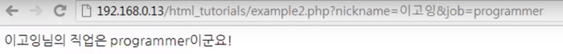
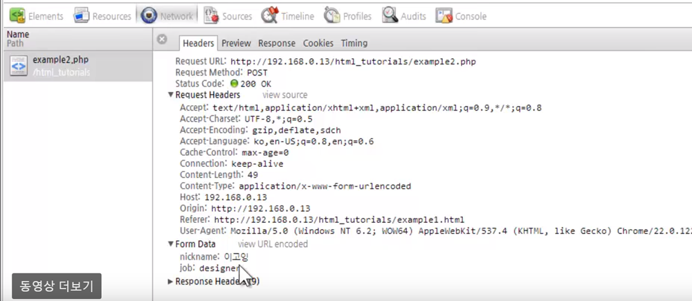

## 네트워크 통신 
자바스크립트를 이용해서 웹브라우저의 통신 기능을 사용하는 방법


## 서버와 클라이언트
- 서버 : 정보를 제공
- 클라이언트 : 정보를 제공 받는 쪽


## 폼(form)
- 사용자의 데이터를 서버에 전송하는 방법
- 일반적으로 아래와 같은 작업을 하기위해서 폼을 이용
- 로그인을 위해서 아이디/비밀번호를 입력할 때
- 회원가입을 하기 위해서 개인정보를 입력할 때
- 블로그나 게시판에 글을 작성하거나, 파일을 전송할 때


## 문법
- form 태그 안쪽에 텍스트를 입력받는 텍스트 필드나, 항목을 선택할 수 있는 라디오 버튼 등이 위치함
- 이러한 요소들을 컨트롤(control)이라고 부름
- 사용자가 컨트롤을 조작한 후 전송버튼을 누르면 form 태그의 속성인 action에 기술된 URL로 입력한 정보를 전송함
- 서버는 이 정보를 받아서 저장하거나, 계산된 결과를 보여주는 등의 작업을 수행하게 됨
```
<form action="서버로 전송한 데이터를 수신할 URL" method="데이터를 전송하는 방법">
  텍스트 필드, 라디오 버튼, 체크 박스와 같은 컨트롤을 생성하는 태그
</form>
```
- action : 사용자가 입력한 데이터를 전송할 서버의 URL
- method : 사용자가 입력한 데이터를 전송하는 방법으로 GET방식과 POST 방식이 있다.
  - get : action에 입력한 URL에 파라미터의 형태로 전송
  - post : header의 body에 포함해서 전송

## GET
- URL에 정보가 담겨서 전송
- 전송할 수 있는 정보의 길이가 제한됨
- 퍼머링크로 사용될 수 있음

### 예제 (서버구축이 된 환경에서만 실행가능)
- example.html : 사용자가 입력한 정보를 서버로 전송
```
<fieldset>
  <legend>GET</legend>
  <form action="./example2.php" method="GET">
    <p>
      닉네임 : <input type="text" name="nickname" /><br />
    </p>
    <p>
      직업 :  
      <select name="job">
        <option value="designer">디자이너</option>
        <option value="programmer">프로그래머</option>
        <option value="planner">기획자</option>
      </select>
    </p>
    <input type="submit" value="전송"/>
  </form>
</fieldset>
```
- 결과


- example2.php : 사용자가 전송한 데이터를 받아서 화면에 표시
```
<?php
echo $_REQUEST['nickname'].'님의 직업은 '.$_REQUEST['job'].'이군요!';
?>
```

- 결과



- Network 모니터링


## POST
- header의 body에 담겨서 전송
- URL에 전달한 정보가 표시되지 않음
- GET에 비해 보안상 약간의 우위에 있음 (사실상 동일)
- 전송할 수 있는 데이터의 길이 제한이 없음
- 퍼머링크로 사용할 수 없음
- 서버쪽에 어떤 작업을 명령할 때 사용 (데이터의 기록, 삭제, 수정 등)

### 예제
- example.html
```
<fieldset>
  <legend>GET</legend>
  <form action="./example2.php" method="POST">
    <p>
      닉네임 : <input type="text" name="nickname" /><br />
    </p>
    <p>
      직업 :  
      <select name="job">
        <option value="designer">디자이너</option>
        <option value="programmer">프로그래머</option>
        <option value="planner">기획자</option>
      </select>
    </p>
    <input type="submit" value="전송"/>
  </form>
</fieldset>
```
- 결과


- 결과


- Network 모니터링




### 참고
- [get과 post의 차이](http://blog.outsider.ne.kr/312)
- [크롬 개발자 도구 Network 모니터링 사용법](https://opentutorials.org/course/580/2868)
