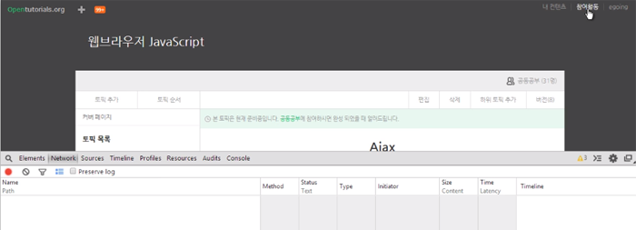
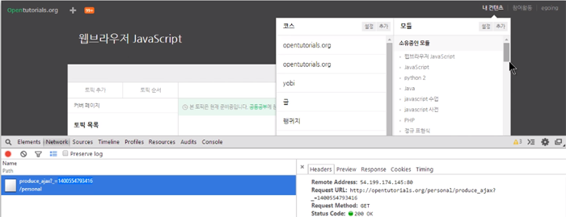
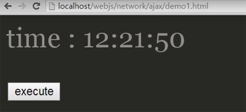
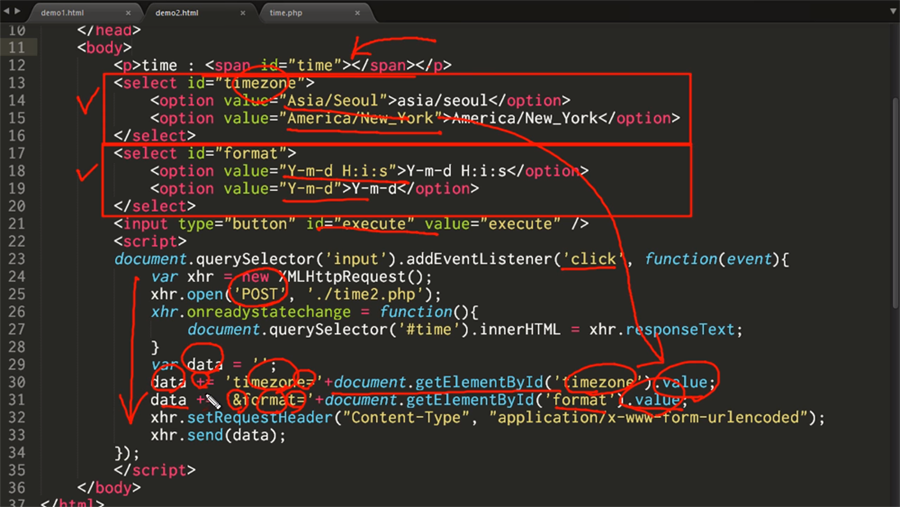
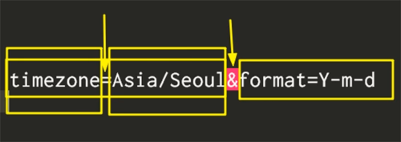

### 네트워크 통신
## Ajax
- Asynchronous JavaScript and XML : 비동기적 자바스크립트와 XML
- 자바스크립트를 이용해서 비동기적으로 웹브라우저와 웹서버가 데이터를 주고 받는 방식
  - 비동기 : 어떤 작업을 실행해두고도 다른 작업이 가능한 것
- 변경된 결과를 웹페이지에 프로그래밍적으로 반영함으로써 웹페이지의 로딩 없이 서비스를 사용할 수 있음
- 이때 사용하는 API :  XMLHttpRequest
- XML 보다는 JSON을 더 많이 사용
- IE5,6 에서는 XMLHttpRequest 객체 대신 ActiveXObject("Msxml2.XMLHTTP.6.0")을 사용
- form은 페이지가 리로드 되기때문에 대안으로 ajax를 사용

<br/>
> 페이지가 로딩됐을땐 파일이 없음

<br/><br/>
> 내컨텐츠 버튼을 누르면 그때 서버에서 파일을 가져옴

- 사용자가 나중에 필요할때 서버에서 가져올수있도록 하는 것 (속도향상)<br/>내컨텐츠를 클릭 후 만약 서버에서 가져오는 시간이 많이 걸린다고 하더라도 현재 페이지에서의 다른 작업이 가능 (비동기)

#### `앞으로의 예제들은 서버환경이 구축되어있지 않으면 실행불가`

## XMLHttpRequest
### GET 방식
- time.php
```
<?php
$d1 = new DateTime;
$d1->setTimezone(new DateTimezone("asia/seoul"));
echo $d1->format('H:i:s');
?>
```
> 현재 시간을 출력

- demo1.html
```
<p>time : <span id="time"></span></p>
<input type="button" id="execute" value="execute" />

<script>
document.querySelector('input').addEventListener('click', function(event){
  var xhr = new XMLHttpRequest();
  xhr.open('GET', './time.php');
  xhr.onreadystatechange = function(){
    if(xhr.readyState === 4 && xhr.status === 200){
      document.querySelector('#time').innerHTML = xhr.responseText;
    }
  }
  xhr.send(); 
}); 
</script>
```
> time.php에 접속해서 현재 시간은 페이지에 표시

- 코드분석
```
var xhr = new XMLHttpRequest();
```
> XMLHttpRequest 객체를 생성
```
xhr.open('GET', './time.php');
```
> 접속하려는 대상을 지정<br/>첫번째 인자는 form 태그의 method에 대응하는 것으로 GET/POST 방식을 주로 사용<br/>두번째 인자는 접속하고자 하는 서버쪽 리소스의 주소로 form 태그의 action에 해당
```
xhr.onreadystatechange = function(){}
```
> onreadystatechange 이벤트는 서버와의 통신이 끝났을 때 호출되는 이벤트
```
if(xhr.readyState === 4 && xhr.status === 200){}
```
> readyState는 통신의 현재 상태를 알려줌<br/>4는 통신이 완료되었음을 의미<br/> status는 HTTP 통신의 결과를 의미하는데 200은 통신 성공 \/ 404는 통신 실패를 의미함
```
document.querySelector('#time').innerHTML = xhr.responseText;
```
> responseText 프로퍼티는 서버(에서 전송한 데이터를 담고 있음<br/>이것을 id가 time 엘리먼트의 하위로 삽입<br/>이를 통해서 현재 서버에서 가져온 현재시간을 페이지 리로딩 없이 가져올 수 있음

- 결과



> excute 버튼을 누를때마다 현재시간을 출력함


### POST
- time2.php
```
<?php
$d1 = new DateTime;
$d1->setTimezone(new DateTimezone($_POST['timezone']));
echo $d1->format($_POST['format']);
?>
```
> Ajax를 이용해서 전송한 데이터를 받아서 현재 시간을 출력해주는 서버쪽 구현

- 코드분석
```
$d1 = new DateTime;
```
> data를 위한 객체생성
```
$d1->setTimezone(new DateTimezone($_POST['timezone']));
```
> 객체의 setTimezone(시간대지정)메소드 사용
```
echo $d1->format($_POST['format']);
```
> 그 객체를 출력할때 format이라는 내용으로 전송한 data 타입에 따라 현재시간을 시간대에 맞게 출력해줌

- demo2.html
```
<p>time : <span id="time"></span></p>
<select id="timezone">
  <option value="Asia/Seoul">asia/seoul</option>
  <option value="America/New_York">America/New_York</option>
</select>
<select id="format">
  <option value="Y-m-d H:i:s">Y-m-d H:i:s</option>
  <option value="Y-m-d">Y-m-d</option>
</select>
<input type="button" id="execute" value="execute" />

<script>
document.querySelector('input').addEventListener('click', function(event){
  var xhr = new XMLHttpRequest();
  xhr.open('POST', './time2.php');
  xhr.onreadystatechange = function(){
    document.querySelector('#time').innerHTML = xhr.responseText;
  }
  xhr.setRequestHeader("Content-Type", "application/x-www-form-urlencoded");
  var data = '';
  data += 'timezone='+document.getElementById('timezone').value;
  data += '&format='+document.getElementById('format').value;
  xhr.send(data); 
});
</script> 
```
> 시간대와 시간의 출력 형식을 지정

- 코드분석



```
xhr.open('POST', './time2.php');
```
> 데이터 전송방법을 GET에서 POST로 변경

```
xhr.setRequestHeader("Content-Type", "application/x-www-form-urlencoded");
```
> 서버로 전송할 데이터 타입의 형식(MIME)을 지정<br/>(html의 form을 통해서 전달한것과 같이 인식시킴)

```
var data = '';
data += 'timezone='+document.getElementById('timezone').value;
data += '&format='+document.getElementById('format').value;
```
> 서버로 전송할 데이터를 형식에 맞게 만듬<br/>이름=값&이름=값... 의 형식을 지켜야 함



```
xhr.send(data); 
```
> send 메소드의 인자로 전송할 데이터를 전달

- 결과


> 시간대와 포맷을 정해서 execute 버튼을 누르면 해당 시간대를 해당 출력형태로 출력함
