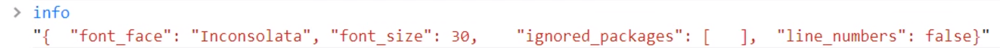
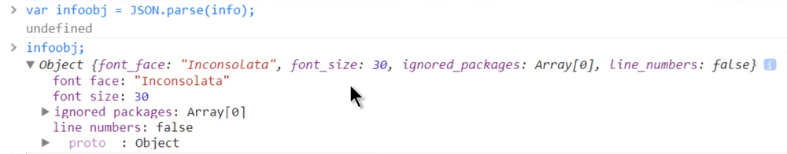
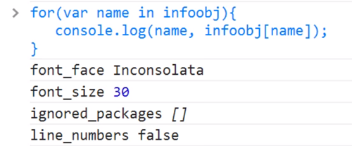
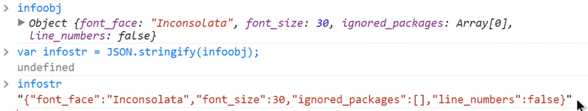

## [JSON(JavaScript Object Notation)](http://www.json.org/json-ko.html)
- JavaScript에서 객체를 만들 때 사용하는 표현식을 의미
- 사람도 이해하기 쉽고 기계도 이해하기 쉬우면서 데이터의 용량이 작음
- 최근에는 JSON이 XML을 대체해서 설정의 저장이나 데이터를 전송등에 많이 사용


## JSON API

### JSON.parse()
- 인자로 전달된 문자열을 자바스크립트의 데이터로 변환

### JSON.stringify()
- 인자로 전달된 자바스크립트의 데이터를 문자열로 변환
```
{
  "font_face":"",
  "font_size":30,
  "ignored_packages":[],
  "line_numbers":false,
};
```
> JSON

```
var info = '{\
  "font_face":"",\
  "font_size":30\
  "ignored_packages":[],\
  "line_numbers":false\
}';
```
> 텍스트(문자)로 전달

- \ : 줄바꿈



```
var infoobj = JSON.parse(info);
```
- 결과



> infoobj가 객체로 변경되어 프로그래밍적으로 제어가 가능해짐



> for문을 통해 값을 하나하나씩 열거



> 자바스크립트 객체(infoobj)를 stringify의 인자로 전달하면 json의 포맷으로 변형한 텍스트를 변수(infostr)에 리턴해줌


## Ajax 와 JSON
- JSON의 진가는 서버와 통신을 할 때 드러남


### JSON이 없을때
- time.php (서버)
```
<?php
$timezones = ["Asia/Seoul", "America/New_York"];
echo implode(',', $timezones);
?>
```
> implode 첫번째인자는 배열의 원소들을 콤마로 구분해 묶어서 하나의 문자로 만들어줌

- 결과
```
Asia/Seoul,America/New_York
```

demo2.html (클라이언트)
```
<p id="timezones"></p>
<input type="button" id="execute" value="execute" />

<script>
document.querySelector('input').addEventListener('click', function(event){
  var xhr = new XMLHttpRequest();
  xhr.open('GET', './time.php');
  xhr.onreadystatechange = function(){
    if(xhr.readyState === 4 && xhr.status === 200){
      var _tzs = xhr.responseText;
      var tzs = _tzs.split(',');
      var _str = '';
      for(var i = 0; i< tzs.length; i++){
        _str += '<li>'+tzs[i]+'</li>';
      }
      _str = '<ul>'+_str+'</ul>';
      document.querySelector('#timezones').innerHTML = _str;
    }
  }
  xhr.send(); 
});
</script>
```
- 코드 분석
```
var _tzs = xhr.responseText;
```
> 서버(time.php)에서 리턴한 값을 변수에 담음<br/>Asia/Seoul,America/New_York

```
var tzs = _tzs.split(',');
```
> 콤마(,)를 기준으로 문자를 잘라서 각각 원소로하는 배열로 만듬<br/>['Aasia/Seoul','America/New_York']

- `split : 문자열 객체가 가진 메소드<br/>인자의 값을 기준으로 문자를 잘라서 배열로 만듬`

```
for(var i = 0; i< tzs.length; i++){
  _str += '<li>'+tzs[i]+'</li>';
}
```
> 반복문이 실행될때마다 li 태그를 만들어 그 안에 해당 원소들을 담아 임시변수인 _str 에 계속 추가를 시킴

```
_str = '<ul>'+_str+'</ul>';
```
> ul 태그로 그것을 감싸줌

```
document.querySelector('#timezones').innerHTML = _str;
```
> id가 timezones인 p태그 안에 출력함

- 결과


> execute 버튼을 누르면 p태그 안에 li태그가 만들어지면서 그 안에 각 배열이 담김

- 정리
```
PHP

echo implode(',', $timezones);
```
> PHP의 배열을 클라이언트(javascript)로 전송하기 위해 콤마로 구분된 문자열을 만든다.<br/>배열을 클라이언트로 전송할 수 없기 때문이다.

```
JavaScript

var tzs = _tzs.split(',');
```
> 자바스크립트에서는 이것을 받아 콤마를 구분자로 다시 배열로 만든다.

- 그러나 JSON은 PHP의 배열을 그대로 자바스크립트에서 사용하거나 반대로 자바스크립트의 배열을 그대로 PHP에서 사용할 수 있다.


## JSON의 사용
- API : Element.classList

### JSON이 있을 때
- time2.php
```
<?php
$timezones = ["Asia/Seoul", "America/New_York"];
header('Content-Type: application/json');
echo json_encode($timezones);
?>
```
- `json_encode : PHP의 데이터를 JSON 형식으로 전환해주는 PHP의 내장함수`<br/>`json_decode : PHP의 데이터를 원래 상태로 전환해주는 PHP의 내장함수`

- 결과
```
["Asia\/Seoul","America\/New_York"]
```

- demo2.html
```
document.querySelector('input').addEventListener('click', function(event){
  var xhr = new XMLHttpRequest();
  xhr.open('GET', './time.php');
  xhr.onreadystatechange = function(){
    if(xhr.readyState === 4 && xhr.status === 200){
      var _tzs = xhr.responseText;
      var tzs = JSON.parse(_tzs);
      var _str = '';
      for(var i = 0; i< tzs.length; i++){
        _str += '<li>'+tzs[i]+'</li>';
      }
      _str = '<ul>'+_str+'</ul>';
      document.querySelector('#timezones').innerHTML = _str;
    }
  }
  xhr.send(); 
});
```
- 코드 분석
```
var _tzs = xhr.responseText;
```
> ["Asia\/Seoul","America\/New_York"] 배열이 담김

```
var tzs = JSON.parse(_tzs);
```
> tzs 는 배열이 됨<br/>서버에서 전송한 JSON 데이터를 JavaScript의 배열로 만듬<br/>즉, php 데이터 형식이 그대로 인자로 전달되어 Javascript의 데이터형식으로 parse됨


### 서버로 데이터 전송
- 서버로 JSON 데이터를 전송하는 것도 가능


#### 예제
- demo4.html
```
<p>time : <span id="time"></span></p>
<select id="timezone">
  <option value="Asia/Seoul">asia/seoul</option>
  <option value="America/New_York">America/New_York</option>
</select>
<select id="format">
  <option value="Y-m-d H:i:s">Y-m-d H:i:s</option>
  <option value="Y-m-d">Y-m-d</option>
</select>
<input type="button" id="execute" value="execute" />

<script>
document.querySelector('input').addEventListener('click', function(event){
  var xhr = new XMLHttpRequest();
  xhr.open('POST', './time3.php');
  xhr.onreadystatechange = function(){
    document.querySelector('#time').innerHTML = xhr.responseText;
  }
  var data = new Object();
  data.timezone = document.getElementById('timezone').value;
  data.format = document.getElementById('format').value;
  xhr.setRequestHeader("Content-Type", "application/json");
  xhr.send(JSON.stringify(data)); 
});
</script>
```

- time3.php
```
<?php
$data = json_decode(file_get_contents('php://input'), true);
$d1 = new DateTime;
$d1->setTimezone(new DateTimezone($data['timezone']));
echo $d1->format($data['format']);
?>
```
