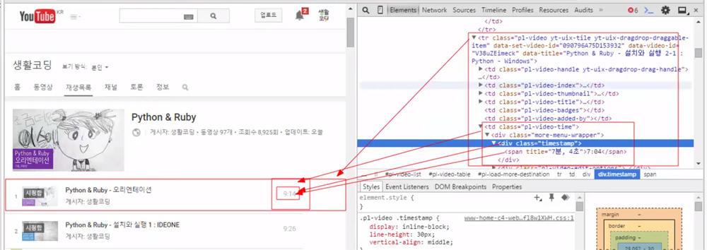
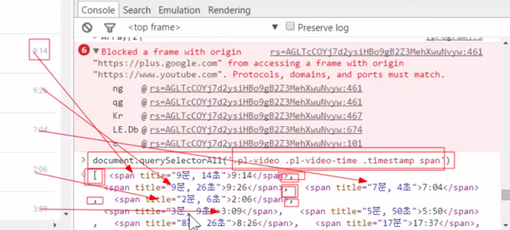

### 활용
## Youtube 재생시간 구하기
```
var times = document.querySelectorAll('.pl-video .pl-video-time .timestamp span');
  var duration = 0;
  for(var i=0; i<times.length; i++){
    var t = times[i];
    t = t.innerText;
    t = t.split(':')
    min = t[0];
    sec = t[1];
    duration = duration + parseInt(sec) + parseInt(min)*60
  }
console.log(duration/60/60);
```
- 코드분석
```
var times = document.querySelectorAll('.pl-video .pl-video-time .timestamp span');
```
> 각 영상의 시간들의 태그를 가져옴<br/>부모를 세밀하게 정하면 정확해짐



- 결과



> querySelectorAll이 각각의 태그들을 배열로 리턴해서 times에 담음

```
for(var i=0; i<times.length; i++){
  var t = times[i]
  console.log(t);  // <span title="9분, 14초">9:14</span>
}
```
> 요소가 하나하나 나열 됨
 
```
for(var i=0; i<times.length; i++){
  var t = times[i]
  console.log(t.innerText);  // 9:14
}
```
> 안에 시간들만 나열 됨

```
t = t.split(':');  // ["9", "14"]
```
> : 를 기준으로 분과 초를 쪼갬

```
min = t[0];  // 9
```
> 분
```
sec = t[1];  // 14
```
> 초
```
duration = duration + sec
```
> 9 14 \/ 10 55 \/ 9 34 일 때,<br/>sec = t[1]에 14가 들어가서 var duration = 0; 이었으니까 14 = 0 + 14 가 됨<br/>다시 55가 들어가서 69 = 14 + 55 가 되고,<br/>34가 들어가 103 = 69 + 34 이 된다.

```
duration = duration + parseInt(sec) + parseInt(min)*60
```
> 분에는 60을 곱해 초로 바꾼 후 모든 값을 더해줌

- `parseInt : 문자는 숫자로 숫자는 문자로 바꿔줌`<br/>만약 `duration + sec + min*60`로 그냥 더해주면 문자끼리 연결되는 꼴이 됨

```
console.log(duration/60/60);
```
> 시간으로 출력시킴


## 수정 (18.05.07)
- Youtube 페이지의 html 코드가 변경되어 코드를 수정함
```
var time = document.querySelectorAll('.style-scope ytd-thumbnail-overlay-time-status-renderer');
```
