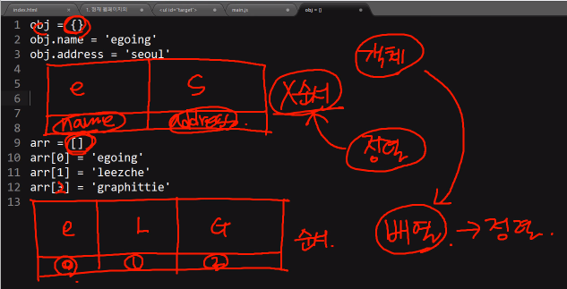

## WordCounter.js
- 문서내의 단어 빈도 랭킹을 구하는 프로그램 만들기

## 문서에서 문자 가져오기
```
var entireText = document.getElementsBytagName('body')[0].innerText
```
> 문서(body)안에 모든 text들을 가져와 변수에 담음


## 문자를 쪼개서 배열에 담기
```
var a = 'a b c d'
console.log(a.split(' '));  // ["a", "b", "c", "d"]
```
> 문자에 담겨있는 값을 인자로 전달된 값을 기준으로 쪼개어 배열로 만들어 리턴함

```
arr = a.split(' ');
console.log(arr.join('+'));  // "a+b+c+d"
```
> 배열안에 있는 원소들을 인자의 값으로 결합함


### 최종
```
var splitedText = entireText.split(' ');  // Array[3536]
```
> 모든 단어를 단어별로 쪼개기<br/>너무 많아서 분할해서 보여줌


## 순차적으로 처리하기
```
for(var i = 0; i < splitedText.length; i++){
  console.log(splitedText[i])
}
```
> for문을 통해서 하나씩 순회하면서 나열해줌


## JS의 객체 설명
- 변수를 이용해 동적으로 객체 프로퍼티에 접근하려면 Array access operator(대괄호 사용하는 것)를 이용하면 된다.
```
var obj = {};
obj.name = 'egoing';
obj.address = 'seoul';
console.log(obj.name);  // 'egoing'
console.log(obj['name'])  // 'egoing'
```
> obj[]처럼 배열로 값을 가져오면 좋은 점은 가져오고 싶은 값을 실시간으로 변경 가능<br/>즉, 인덱스의 값을 변수로 처리해서 동적으로 처리가능

```
proname = 'name';
console.log(obj[proname]);  // egoing
console.log(obj.proname);  // undefined
```
> obj.proname는 변수가 아니고 프로퍼티가 돼버려서 값을 가져올 수 없음<br/>`*.~ : 프로퍼티`<br/>`*[] : Array access operator`


## 등장빈도 계산하기
```
var countedWord = {};

for(var i = 0; i < splitedText.length; i++){
  var word = splitedText[i];
  countedWord[word] = 0;
  console.log(countedWord);
}
```
> 모든 문자들이 출력되고 해당값이 전부 0이 됨

> countedWord[word]의 word는 countedWord 객체의 저장될 프로퍼티의 이름이 됨

```
if (countedWord[word] == undefined) {
  countedWord[word] = 1;
}
```
> 이 단어가 문서에 처음 등장했다면 카운팅을 1로 함

```
else {
  countedWord[word] = countedWord[word] + 1;
}		
```
> 아니면 기존에 값에 + 1 함


## JS 배열의 정렬 방법
- 객체 : 순서가 없으므로 정렬할 수 없음
- 배열 : 순서가 있으므로 정렬할 수 있음



```
var arr = ['egoing', 'leezche', 'graphittie'];

console.log(arr.sort());
```
> 알파벳 순서대로 정렬
```
arr.sort(function(a, b){
  console.log(a, b);
});
```
- 결과
```
egoing graphittie
graphittie leezche
```
> 첫번째 인자로 함수를 주게되면 각각의 원소들을 서로 비교하게 됨

```
var arr = ['egoing', 'leezche', 'graphittie', 'ecstasyandkind', 'kooljaek'];

arr.sort(function(a, b){
  return a.length - b.length
});
```
> 길이가 짧은 순에서 부터 긴 순으로 정렬
```
return a.length + b.length
return b.length - a.length
```
> 길이가 긴 순에서 부터 짧은 순으로 정렬

> return 값이 1 : a > b \/ 0 : a = b \/ -1 : a < b 


## 단어 빈도에 따라서 정렬
- sort를 이용해 정렬하기위해 countedWord 객체를 배열로 만든다.
```
var countedWordArr = new Array();
```
> new Array() 는 []; 와 같음

```
for(var name in countedWord){
  console.log(name, countedWord[name])
}
```
> countedWord 프로퍼티 이름, countedWord 프로퍼티 값

```
for(var name in countedWord){
  countedWordArr.push([name, countedWord[name]])
}
```
> 단어 이름, 단어의 등장 횟수를 원소로하는 배열을 countedWordArr의 원소값으로 추가


```
countedWordArr.sort(function(a, b){
  return a[1] - b[1];
});
```
> 카운팅 횟수를 뜻하는 두번째 인자인 countedWord[name]을 각각 서로 빼줌

> 숫자가 낮은 순에서 높은 순으로 정렬 됨


## 콘솔의 출력과 동작 방법의 개선
```
for(var i = 0; i < countedWordArr.length; i++){
  console.log(countedWordArr[i][0], countedWordArr[i][1]);
}
```
> 단어가 몇번 반복되고 있는지를 출력해줌

```
str = "AaaaA"

str.toLowerCase()  // aaaaa
str.toUpperCase()  // AAAAA
```
> 모든 알파벳을 소문자 혹은 대문자로 변경
```
for(var i = 0; i < splitedText.length; i++){
  var word = splitedText[i].toLowerCase();
}
```
> 모든 알파벳을 소문자로 바꿔서 카운팅함<br/>같은 단어인데 대문자인지 소문자인지에 따라 다르게 카운팅되기 때문이다.


## 정리
- 현재 웹페이지의 모든 텍스트에서 
```
var entireText = document.getElementsByTagName('body')[0].innerText;
```

- 단어들을 쪼갠 후에 
```
var splitedText = entireText.split(' ');
```

- 등장 횟수를 계산하고
```
var countedWord = {};
for(var i=0; i<splitedText.length; i++){
  var word = splitedText[i].toLowerCase();
  if(countedWord[word] == undefined){
    countedWord[word] = 1;
  } else {
    countedWord[word] = countedWord[word] + 1;
  }
}
```
 
- 정렬 한 후에
```
var countedWordArr = new Array();
for(var name in countedWord){
  countedWordArr.push([name, countedWord[name]])
}

countedWordArr.sort(function(a, b){
  return a[1] - b[1];
})
```
 
- 콘솔창에 출력한다
```
for(var i = 0; i < countedWordArr.length; i++){
  console.log(countedWordArr[i][0], countedWordArr[i][1])
}
```

- 콘솔창에 출력2 (console.log를 alert으로)
```
countedWordArr.sort(function(a, b){
  return b[1] - a[1];
});
```
> 빈도수 많은 순 에서 적은 순으로 정렬<br/>빈도수가 많은것을 보려면 alert창은 밑에까지 스크롤을 내려야 하므로 정렬를 바꿔줌

```
var str = '';
for(var i = 0; i < countedWordArr.length; i++){
  str = str + (countedWordArr[i][0] + " : " + countedWordArr[i][1])+"\n";
}
alert(str);
```
> 경고창은 인자를 하나만 받는다.<br/>출력될 결과를 문자(str)로 만들어놓고 for문이 돌때마다 str에 하나씩 순차적으로 추가한다.<br/>그리고 마지막에 한번만 실행한다.<br/>그렇지 않으면 반복문이 끝날때까지 경고창이 반복된다.

- `\n : 줄바꿈`
