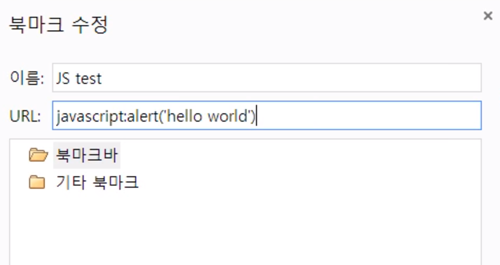
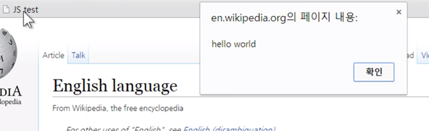

## 북마클릿
- 주소창에 javascript:를 입력하면 자바스크립트를 실행할 수 있는 원리를 이용해서 현재 웹페이지에서 다양한 기능을 처리할 수 있는 기능
- 주소창에 javacscript:alert('hello'); 입력하면 실행됨
- 이 점을 착안해서 북마크를 추가하고 url에 javascript:태그입력 을 넣어주면 북마크를 해두고 필요할때마다 실행시킬수 있음

- 결과

- 찾을대상 online : 온라인에서 어떠한것에 대해 연습해볼공간이 필요할 때 주소창에 검색하는 방법
- ?bookmaklet online : 온라인에서 북마클릿을 연습할 공간 찾기
- [북마클릿 연습](http://mrcoles.com/bookmarklet/)
  - 만든 코드를 붙여넣고 comvert to bookmarklet 클릭하면 아래에 북마크링크로 치환해준다. 이것을 복사해서 북마크 url에 추가해서 필요할때마다 사용하면 된다. 아래 this link 버튼을 클릭하면 바로 실행해볼 수 있다. 주석이 있으면 오류가난다.
